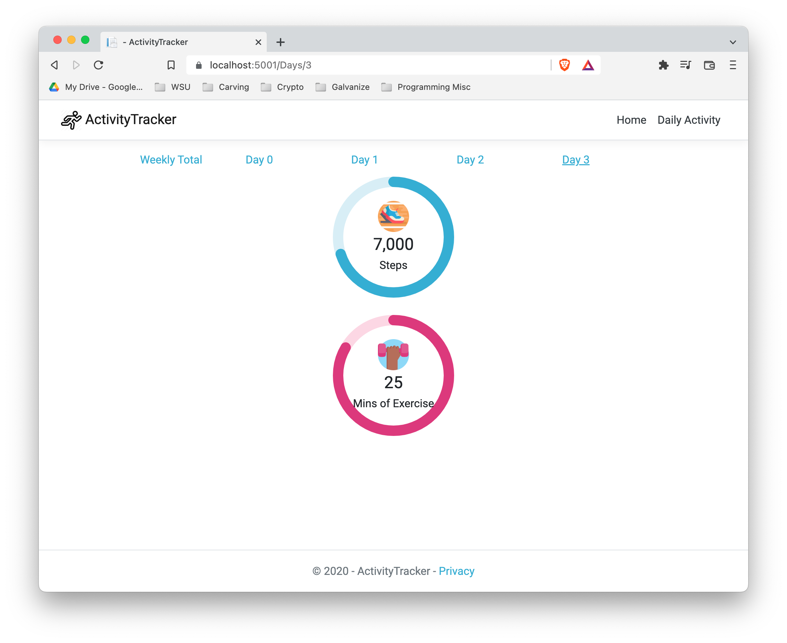

<h3 align="center">Activity Tracker</h3>

     
    <a href="https://github.com/coltskeen/Activity-Tracker">Report Bug</a>
    ·
    <a href="https://github.com/coltskeen/Activity-Tracker">Request Feature</a>

  
  

 </a>

---

💡 Project description 

## Table of Contents

- [Project Description](#project_description)
- [Built With](#built_with)
- [Roadmap](#roadmap)
- [Contributing](#contributing)
- [Final Note](#ps)

## I. Project Description

(<a href="#top">back to top</a>)

## I. Built With

(<a href="#top">back to top</a>)

## I. Roadmap

(<a href="#top">back to top</a>)

## I. Contributing

(<a href="#top">back to top</a>)

## I. Final Note

